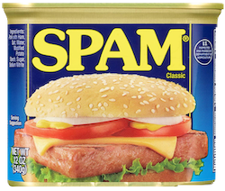

# Do you like SPAM?

## 概要

Pythonで作成した簡単なクリックゲームです。 
プログラミング言語Pythonの語源たるイギリスのコメディグループMontyPythonに敬意を払って、 
彼らの有名スケッチ模した内容にしました。 
画面内に表示されるSPAM缶をひたすらクリックするゲームです。 
LibertyBellの曲が流れている間、ひたすらSPAM缶をSPAMしましょう。 

## 免責事項

このリポジトリは学習目的で作成したものです。 
このリポジトリに含まれる一切を使用したことによに発生した不具合、損害等について製作者は一切の責任を負いません。 

## 遊び方

### 必要条件

このゲームはPythonとPython向けのゲームライブラリpygameを使用しています。 
お使いの環境にインストールしてから起動してください。 
QiitaでMac環境でのPython環境構築についてまとめましたが、詳細については各公式サイトで確認して下さい。 

* [MacOS CatalinaにPythonとPython向けライブラリをインストールする - Qiita](https://qiita.com/linus_sh/items/f46d3abc7a854706f72e)
* [Python](https://www.python.org/)
* [pygame](https://www.pygame.org/news)

※注意 
リポジトリ作成時点ではpygameの最新安定版は1.9.6ですが、MacOS環境ではpygame1.9.6がうまく動作しないことがあります。 
その場合は2.0以降のpygameをインストールしてください。 

### 起動方法

このリポジトリをダウンロード後、ターミナルでこのリポジトリのフォルダに移動し、 
`python spam-game.py` を実行してください。 

### 遊び方

* 起動すると以下の様な画面が表示されます。SPAM缶をクリックするとゲーム開始です。 

* ゲームを開始するとLibetyBellの曲とともにSPAM缶が画面内にランダムに表示されます。 

* 制限時間内に画面内のSPAM缶をひたすらクリックしてください。制限時間は30秒です。 

時間内にクリックしたSPAM缶の数がそのままスコアとなります。 

* ゲーム終了後、最終スコアとハイスコアを確認できます。SPAM缶をクリックすると再度プレイできます。 

## 開発環境 / 使用技術

### 開発環境

* MacBookPro Mid 2014 15inch
* macOSX Version 10.14.6
* Visual Studio Code for mac 1.46.1

### 使用技術

* Python 3.8.3 64bit
* pygame 2.0.0.dev10
