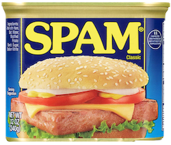
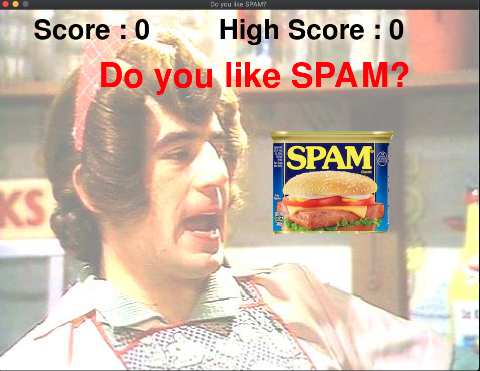
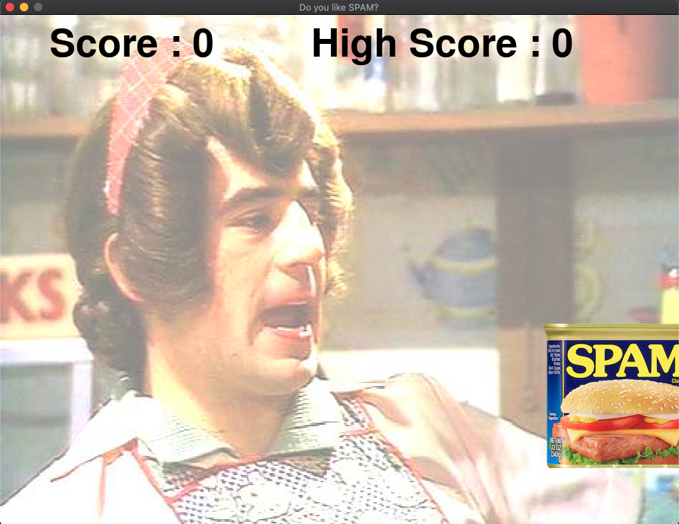
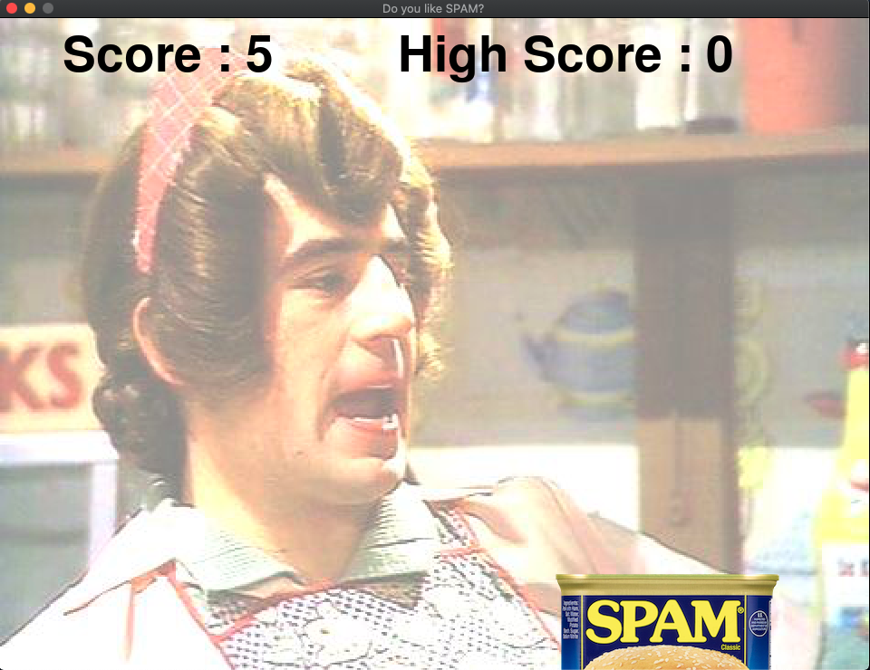
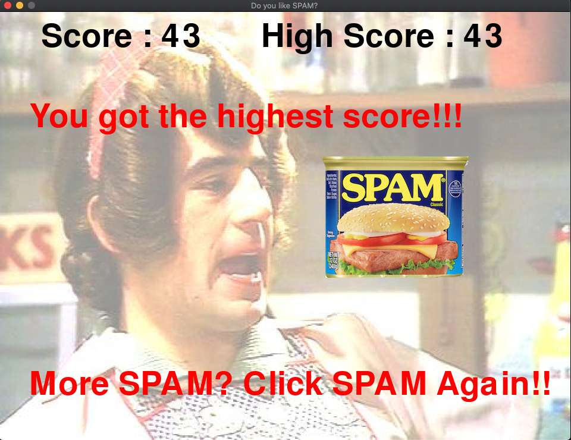

# Do you like SPAM?

## 概要

Python で作成した簡単なクリックゲームです。 
プログラミング言語 Python の語源たるイギリスのコメディグループ Monty Python に敬意を払って、 
彼らの有名スケッチ模した内容にしました。 
画面内に表示される SPAM 缶をひたすらクリックするゲームです。 
Liberty Bell の曲が流れている間、ひたすら SPAM 缶 を SPAM しましょう。 

## 免責事項

このリポジトリは学習目的で作成したものです。 
このリポジトリに含まれる一切を使用したことによに発生した不具合、損害等について製作者は一切の責任を負いません。 

## 遊び方

### 必要条件

このゲームは Python と Python 向けのゲームライブラリ pygame を使用しています。 
お使いの環境にインストールしてから起動してください。 
インストール方法については各公式サイトを参照してください。

- [Python](https://www.python.org/)
- [pygame](https://www.pygame.org/news)

※注意 
リポジトリ作成時点では pygame の最新安定版は 1.9.6 ですが、MacOS 環境では pygame 1.9.6 がうまく動作しないことがあります。 
その場合は 2.0 以降の pygame をインストールしてください。

### 起動方法

このリポジトリをダウンロード後、ターミナルでこのリポジトリのフォルダに移動し、 
`python spam-game.py`を実行してください。

### 遊び方

- 起動すると以下の様な画面が表示されます。SPAM 缶をクリックするとゲーム開始です。 
  
- ゲームを開始すると Libety Bell の曲とともに SPAM 缶が画面内にランダムに表示されます。  

- 制限時間内に画面内の SPAM 缶をひたすらクリックしてください。制限時間は 30 秒です。 
  時間内にクリックした SPAM 缶の数がそのままスコアとなります。 
  

- ゲーム終了後、最終スコアとハイスコアを確認できます。SPAM 缶をクリックすると再度プレイできます。 
  

## 開発環境 / 使用技術

### 開発環境

- MacBookPro Mid 2014 15inch
- macOSX Version 10.14.6
- Visual Studio Code for mac 1.46.1

### 使用技術

- Python 3.8.3 64bit
- pygame 2.0.0.dev10
